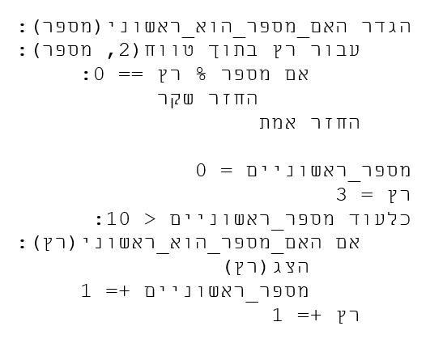

# HebrewPython
A compiler from HebrewPython to Python

# Why Is It Useful?
It allows humans that knows Hebrew well but don't know English that well to program without a natural language barrier.
Actually, to write Hebrew Python you don't have to understand English at all!

# How To Use It?
First, make sure you have installed Python 3.
Write Hebrew Python code in a file. For the example, we assume that the file path is 'C:\check.hpy'.
Navigate to the Hebrew Python Compiler directory with your cmd, and type:
```
python C:\check.hpy
```
Then, the English Python version of your code will be printed and then your program will run.

# Example
Look at the following code:



# What Languate Features It Supports?
functions definitions, booleans, conditions, returns from a function, for loops, while loops, print function, input function, int, float, complex, str, dict, list, set, range, and, or.
